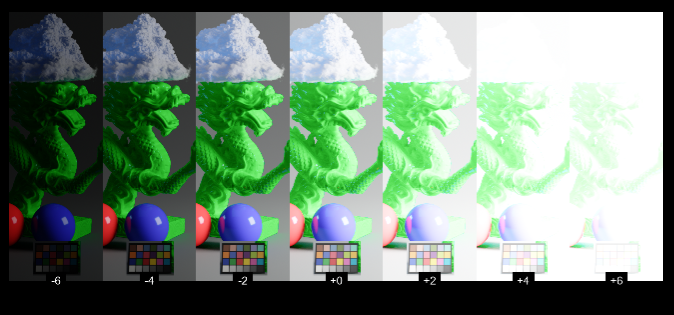

# exposure-bands

generate successive bands of gradually increasing exposure.

This is useful when testing and prototyping image-rendering transform and
you need to evaluate its render against different exposure of a same source.

# design

Be aware that to be dynamic as possible the node generate the exposure bands
on different frames. This implies also having tcl expression using the `frame`
variable which can sometimes lead to unstabilities.

# adding dynamic text on each band

It's possible to add text indicating the exposure value of each band without
manually creating a text node for each band, however it's a bit tricky:

- Go inside the node
- Between the 2 internal nodes add a `ModifyMetadata` node
  - add a single `_bands_exposure` key
  - as value of that key put the tcl expression `[value parent._exposure]`
- Add a `Text` node after the `ModifyMetadata` 
  - in the message put the tcl expression `[metadata _bands_exposure]`
  - configure the Text node as you wish
  
> Why using a ModifyMetadata node ?

This is the only hack I found so Nuke properly pickup the band exposure for
its correct frame (remember the tool use the frame-range to work).

> [!TIP]
> If you are using the tool for evaluating image rendering you probably don't
> want the text to be affected by it, so you will have to put an OCIODisplay
> node or whatver you use for your image rendering before the text node but after
> the first internal exposure node.