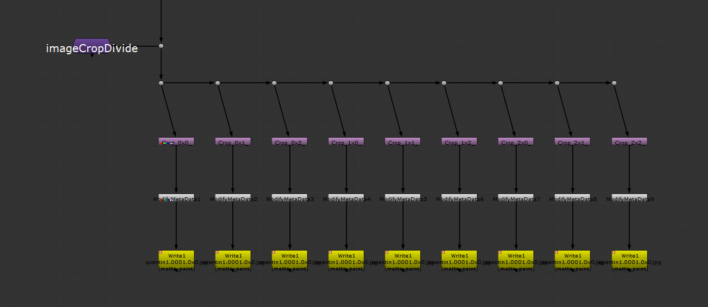
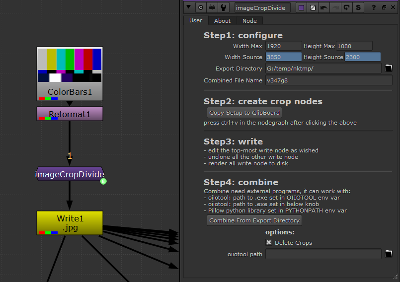

# imageCropDivide

From given maximum dimensions, divide an input image into multiples crops.

Compatible with:
- Nuke Non-Commercial
- Python > 2.7
- Windows, Mac

# Use

The most straightforward setup is to paste/insert the [node.nk](node.nk) node 
into your nuke script, setup it and execute the script button.

- Set the desired max dimensions and your source size.
- Click the `Copy ...` button
- press ctrl+v to paste the node setup in the nodegraph.
- On any of the Write node, modify the settings for export.
- Unclone all the Write nodes `(Alt + shift + K)`

_Why is there a ModifyMetadata node ?_
> This is the only way I found for now to have a different suffix per Write 
> node and have them cloned at start. I could remove them and set directly the 
> suffix on each unique Write node but then it would be a pain to modify one setting
> on all the write nodes.

# Licensing 

**Apache License, Version 2.0** (OpenSource)

See [LICENSE.md](./LICENSE.md).

Here is a quick resume :

- ✅ The licensed material and derivatives may be used for commercial purposes.
- ✅ The licensed material may be distributed.
- ✅ The licensed material may be modified.
- ✅ The licensed material may be used and modified in private.
- ✅ This license provides an express grant of patent rights from contributors.
- 📏 A copy of the license and copyright notice must be included with the licensed material.
- 📏 Changes made to the licensed material must be documented
