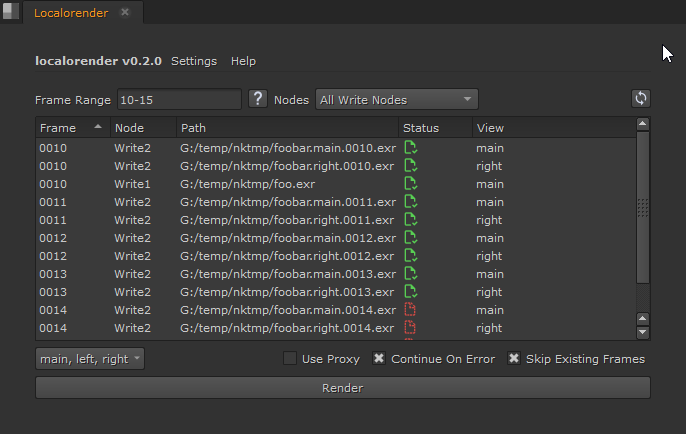

# localoRender

A nuke script opening a GUI to render Write nodes to local disk.

This is a tool built over the builtin nuke render dialog with various 
improvements added.



# features

- Add "skip existing frames" options.
- Add a view filter menu to restrict the number of view to render, if any.
- Add a widget to visualize all the path that will be rendered.
- Add an option to change which Write nodes are used for rendering.
- Support regular nuke frame-range syntax.
- Supports `#` frame tokens in paths.
- Supports tcl expression in paths.
- Supports `%V` and `%v` tokens in paths.
- Can be docked in the regular Nuke interface.
- Settings system to remember your configuration between sessions.

Unsupported:

- rendering to Background
- rendering to frame server

# pre-requisites

The tool is self-contained and doesn't have external dependency. It 
requires PySide2 to work, but it's bundled with Nuke.

The tool is compatible with:
- python-2 and python-3
- any operating system
- at least Nuke, Nuke X and Nuke Non-Commercial (probably others) 

It was developed and tested on Nuke 15 Non-commercial on Windows.

Note that the tool is writing files in your system default temporary directory,
which are deleted on tool exit (needed for the icons in the GUI). 

# installation

You can install the tool in multiple ways dependending on your preferences.

Note that you can combine multiple installation methods if desired.

## as a new menu entry

- Copy [localorender.py](localorender.py) to your local nuke path (`~/.nuke`)
- At the same location, edit the `menu.py` file (or create it):
  - add the following content inside to open as a detached nuke panel.
    ```python
    import nuke
    import localorender
    
    menu = nuke.menu("Nuke").menu("Render")
    menu.addCommand("Open LocaloRender", lambda: localorender.open_as_panel(), "F8")
    ```
  - OR add the following content inside to open as a modal dialog.
    ```python
    import nuke
    import localorender
    
    menu = nuke.menu("Nuke").menu("Render")
    menu.addCommand("Open LocaloRender", lambda: localorender.open_as_panel(modal=True), "F8")
    ```
  - you can also change the shortcut in the above code from `F8` to what you prefer.

## as a new pane option

- Copy [localorender.py](localorender.py) to your local nuke path (`~/.nuke`)
- At the same location, edit the `menu.py` file (or create it):
  - add the following content inside:
    ```python
    import localorender
    localorender.LocaloRenderPanel.register()
    ```

## overriding the default render dialog

- Copy [localorender.py](localorender.py) to your local nuke path (`~/.nuke`)
- At the same location, edit the `menu.py` file (or create it):
  - add the following content inside:
    ```python
    import nukescripts
    import localorender
    
    nukescripts.showRenderDialog = localorender.nukescript_showRenderDialog
    ```

## in a python knob

You can create a Python knob on any node copy/paste the whole script inside.

You can optionally edit the last line `open_as_panel()` to replace it by
`open_as_panel(modal=True)` if you prefer a modal dialog, than a floating
panel.

## code snippet

You never install the tool and just copy/paste it in the script editor every time.

You can optionally edit the last line `open_as_panel()` to replace it by
`open_as_panel(modal=True)` if you prefer a modal dialog, than a floating
panel.

# usage

The tool is used pretty much like the native nuke Render Dialog, except that
you now see exactly what will be rendered.

The widget with a list item display all the paths that will be rendered to disk.
If a path is not listed it will not be rendered. However, dependening on
if you checked the "Skip Existing Frames" option, not all path listed will be
rendered.

By default the tool will have the frame range set at project level, you can 
right click on the frame-range field to see the other presets available.


## settings

From the top menu-bar. 

Settings are saved in memory so you the tool can remember
its configuration between sessions.
Settings are only saved when you click the `Render` button, but you can manually
trigger the save by clicking the corresponding option in the menu.

If something get corrupted you can:
- use the `Reset Default Settings` option in the menu
- set the `LOCALORENDER_DISABLE_QSETTINGS` environment variable to any non-null value.
  When the GUI is creating the settings will not be loaded.