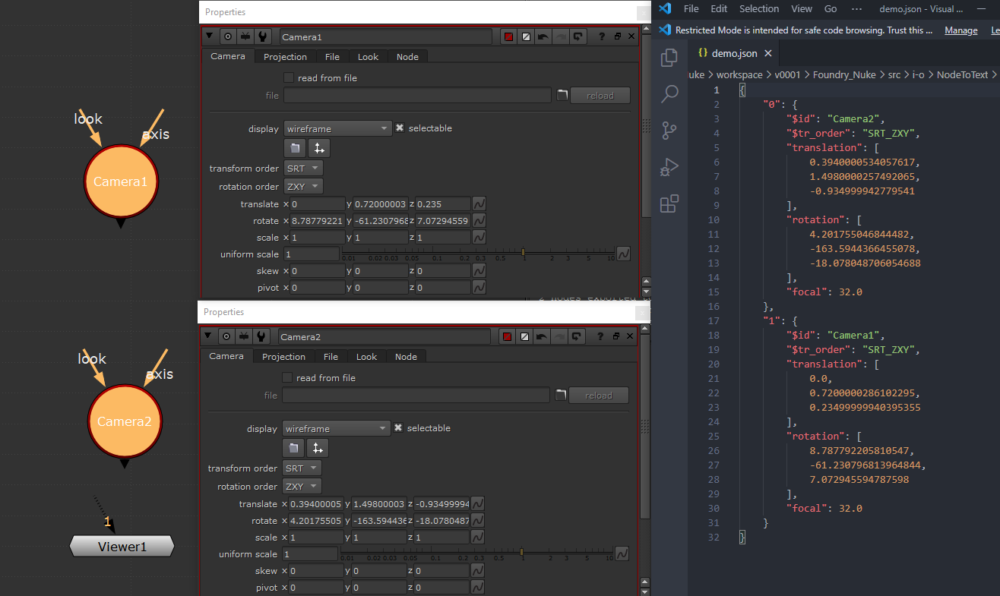

# Node To Text


Convert the selected nodes knobs:values to a .json.




## Use

1. Copy/paste the script in the Script Editor.

2. Make sure the node you are going to export is registered in the <config_dict>.
    If not looks at <config_dict> docstring to know how.

3. Select the nodes you want to export.

4. Execute script.

5. A file dialog will appear, give a full path to the desired location of the .json file.

## Dev

### Logging

Logging is by default set to `debug`. You can modify the line ~53 where 
`logger` variable is declared by passing the desired logging level.

### Supporting more nodes.

The script was made to support any kind of node as long as you set up them.
To do so you have to extend the `config_dict` variable :


level0
>`[key]` `(str)`:
> identifier for node type
>
>`[key:value]` `(dict)`:
> data for processing
> 
> Each key is just used as an identifier internally. Should correspond to the 
> type of your node. ex: Grade, Roto, myCustomNode, ...
> 
> See the under to see how the value dict is built.

level1
> `[key:value.key=check:value]` `(function)` : 
>   function used to determine if a node correspond to current `[key]`.
> 
>   Args:
>       node(nuke.Node): Nuke node
>   Returns:
>       bool:
>       Where True means the node correspond to current `[key]`.
> `[key:value.key=data:value]` `(dict)` : 
>   data that will be extracted from the node (see under)
> 
> There is only 2 key possible at this level : check or data.

level2
> Determine waht is exported from the node, and how it is stored in the .json
> If they key is without a `$`, it is assumed to be a knob's path and will
> be stored as such : `{value:node.getKnob(key).value()}`
> 
> `[key:value.key=data:value.key]` `(str)` : 
>   path of the knob on the node
> `[key:value.key=data:value.key:value]` `(str)` : 
>   key name of the knob's value in the output dict.
>
> `[key:value.key=data:value.key=$(any):value]` `(function)` :
>   if the key start with a `$`, the exported result will be `{$key:value(node)}`
>   the value must be a function as such :
>   Args:
>       node(nuke.Node): Nuke node
>   Returns:
>       any: the returned with be used as 
> 
> `[key:value.key=data:value.key=$id:value]` `(function)` : 
>   special key that is mandatory.
>   This dict value, once evaluated, must allow to identify the source node.
>   The returned value by the function must be a string.

#### example

Here is an example to export the Grade's node.
We choose to only export the `gain` and `gamma` knob.
For the demo we also export the `gain` knob named as `add` in the .json.

```python
config_dict = {
    "Grade": {
        "check": lambda node: True if node.Class == "Grade" else False,
        "data": {
            "$id": lambda node:
                "{}_{}".format(node.name(), node.knob("gain").value()),
            "gain": "add", 
            "gamma": "gamma",
        }
    }
}
```

We then select our only grade node, and this is a potential result :

```json
{
  "0" : {
    "$id":"Grade3_0.85",
    "add": 0.85,
    "gamma": 1.0
  }
}
```


