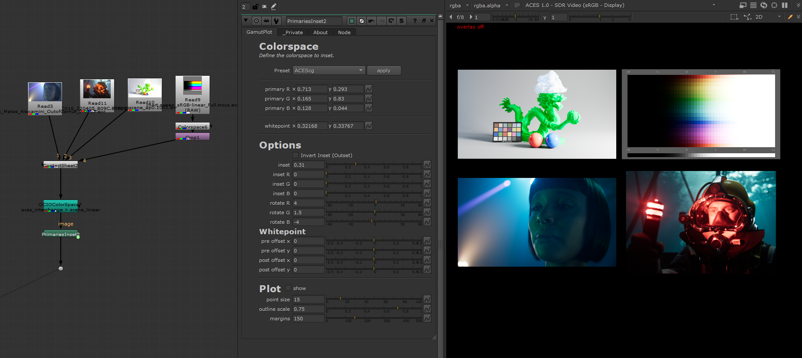
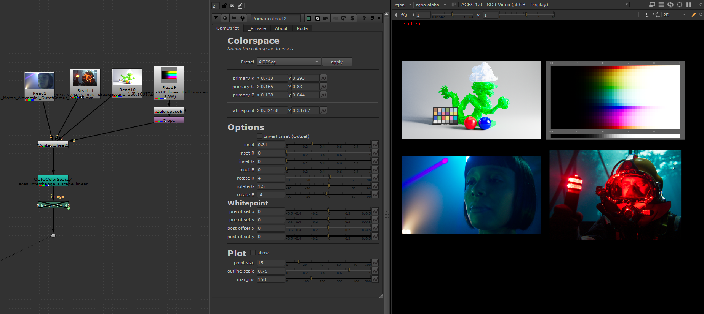
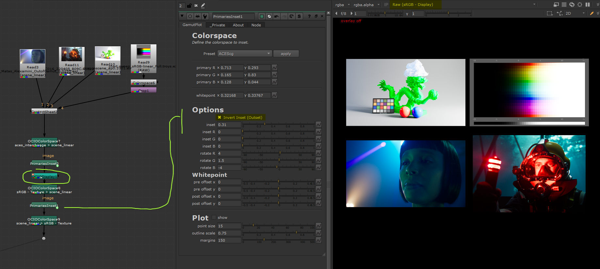
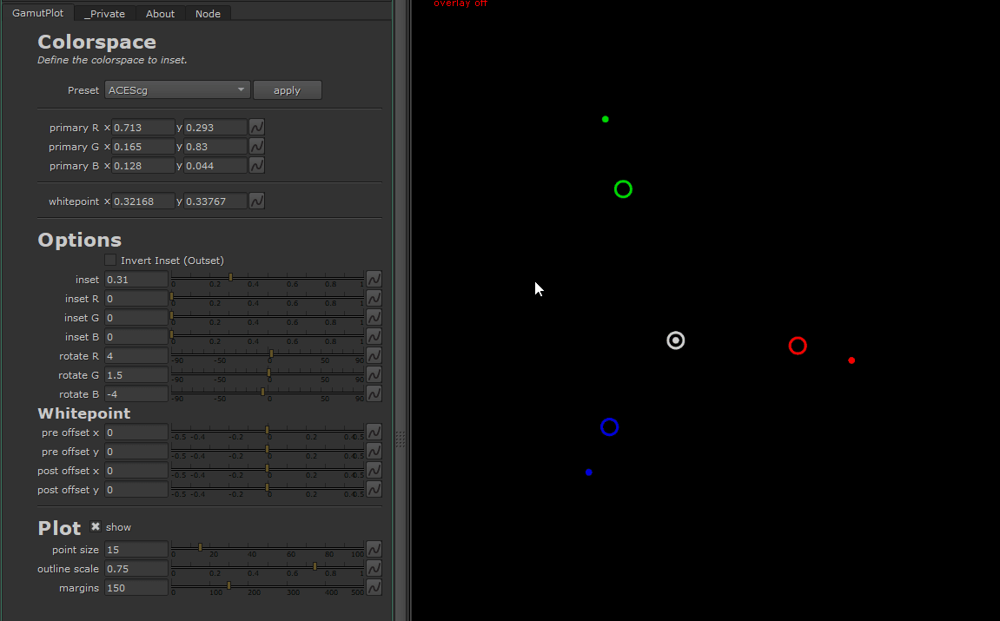

# Primaries Inset

Create a reshaped version of a colorspace's gamut and apply it on images using
a 3x3 matrix. It is possible to visuallize the gamut transformation in a 
CIE xy graph plot.

The reshape transformation is called an "inset" as we are creating a smaller
gamut than the original.

This is the main concept behind [the AgX DRT](https://github.com/MrLixm/AgXc) which
was also [ported to darktable](https://github.com/darktable-org/darktable/pull/15104).

And disabled :

The above example is in the context of a traditional ACES workflow (note the
ACES view-transform in the viewer) but could be used with any other "tonemapping".

The PrimaryInset operation works closely with the application of a 1D tonescale curve
(usually reffered as tonemapping) after itself.

If you find the effect of the Inset too strong and just woudl like to fix those
very saturated camera artefact it's possible to apply an outset after the inset :

Unfortunately the workflow require to bake the view transform in the chain
(OCIO Display node) :
1. apply ACES view-transform
2. revert the sRGB EOTF conversion to get back ACEScg value 
3. duplicate the first `PrimaryInset` node but check the `Invert` option
4. reapply the sRGB EOTF conversion

## plotting

It is possible to preview the new inset colorspace as a plot in the CIE1931 xy space.

Just check the `show` checkbox next to the `Plot` title.

# Instructions

## Install

- Copy/paste the content of [PrimariesInset.nk](PrimariesInset.nk) in any nuke
scene.
- That's it

System :
- PrimariesInset uses:
  - python code for `Presets` but works on non-commercial versions.
  - blink script but works on non-commercial versions >= 14.0
- The python code _should_ be python 2 compatible but has only been tested on latest
python3 versions of Nuke.

## Usage

- Expect an image to be transformed as input.
- Select the preset corresponding to the input image's colorspace encoding.
- Click the apply button: the _primary X_ and _whitepoint_ knobs are updated.
- In the _Option_ section, start playing with the global inset.
- To see exactly how it affect the original colorspace you can click on `show` 
in the _Plot_ section : your image disapear to leave a dark squared canvas with
only a gamut visible.
- Keep playing with the _Options_ to see how it works.

# Developer

See the [./src/](./src) folder for the original files that create the final node.

## TODO

- [ ] fix NO_HANDLE flag issue that doesn't seems to work
