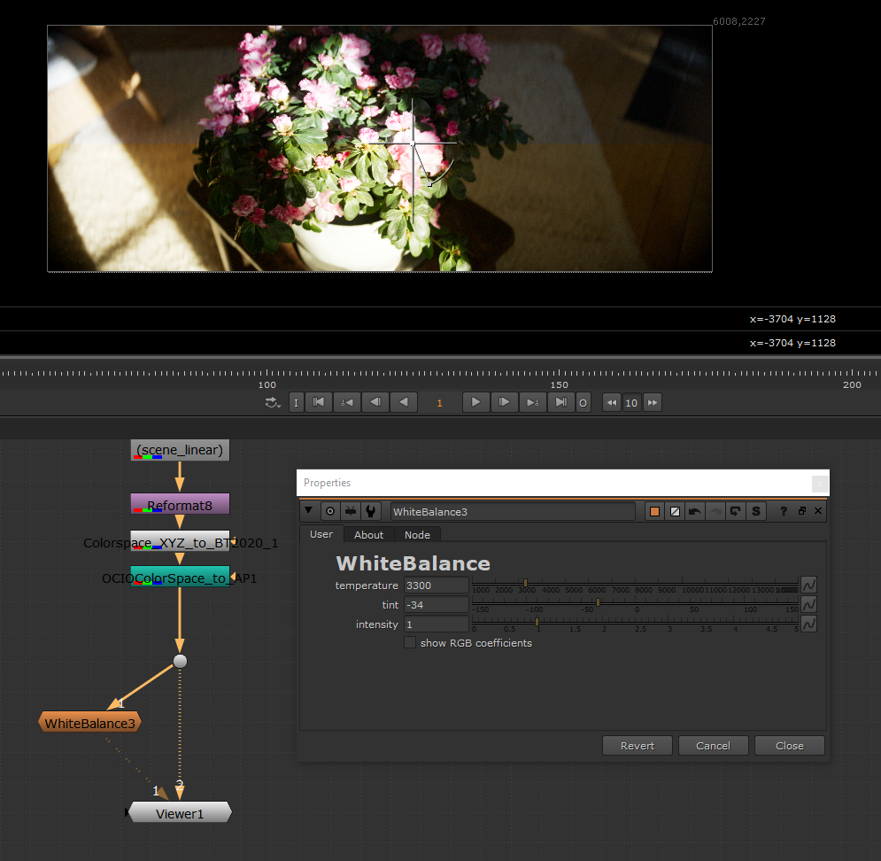

# White Balance

Change the "white balance" of your source imagery.

This is not a technical transform and was more designed as creative transformation tool.
Usually whitebalancing is applied on undemosaiced raw camera data while
this node will operate on already debayered data.

# Instructions

## Install

- Copy/paste the content of [WhiteBalance.nk](WhiteBalance.nk) in any nuke
scene.
- That's it

## Requirements

The tool use the following features :

- blink script but works on non-commercial versions >= 14.0

## Reference

Default value for temperature and tint try to match the value of the illuminant E
which should produce a "no-operation" result.

### temperature

In Kelvin, lower produce a warmer look, higher a colder one.

### tint

Deviation from the planckian locus, referred usually as "D*uv*". Scaled x3000
for conveniency. Negatives values produce a pink shift while positive value a green tint. 

### intensity

Strength of the effect applied as a simple linear interpolation. 0.0 means no
effect. 

### show RGB coefficients

Fill the image with the R-G-B coefficient used to whitebalance the image. Useful
for debugging or alternative workflow:
- provide a 1x1 pixels input in the node
- check `show RGB coefficients`
- reformat output to size of your image
- merge previous step with the actual image using a `multiply` blend mode

# Developer

See the [./src/](./src) folder for development instructions.
